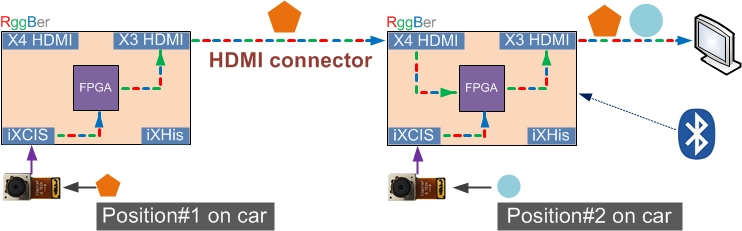

### Introduction

This is FPGA project for ADAS applications. User needs 2 RGGBers for this demo. Download this project to the RGGBers controlled by Android App. The project in [full-HD-camera](https://github.com/rggber/full-HD-camera) folder should be downloaded to another RGGBer.

In current rev.3 hardware, user still needs [MCU project](https://github.com/rggber/rggber-mcu-prj) for configurations and wireless control. But in rev.4 which will be deliverable version, both MCU and FPGA can do all of those.

### Diagram

